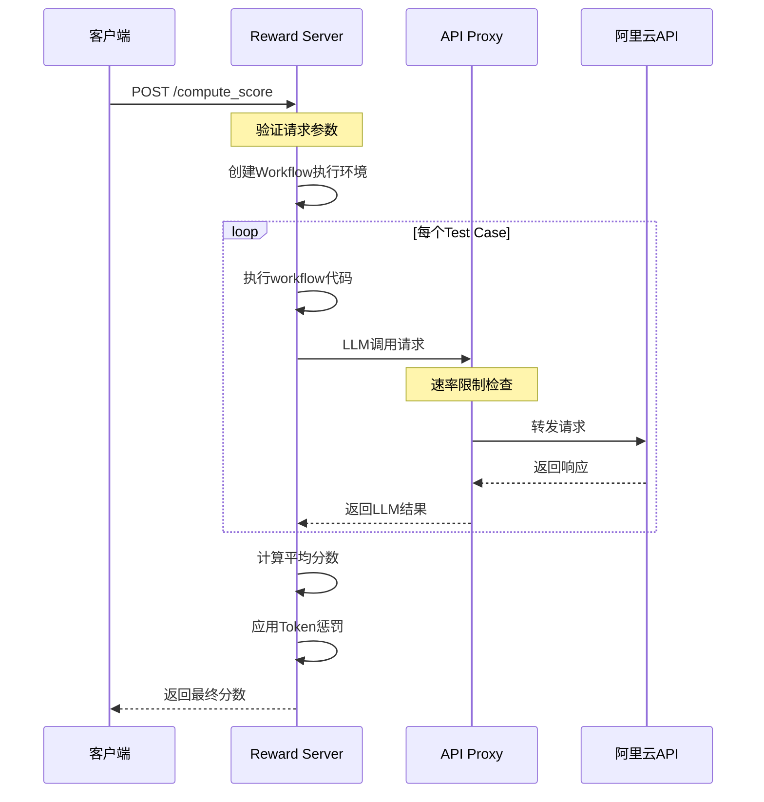

# API代理与Reward服务器架构详解

## 目录
- [系统概述](#系统概述)
- [架构设计](#架构设计)
- [核心组件](#核心组件)
  - [API代理服务](#api代理服务)
  - [ScoreFlow Reward服务器](#scoreflow-reward服务器)
- [服务交互流程](#服务交互流程)
- [配置管理](#配置管理)
- [关键特性](#关键特性)
- [部署与运维](#部署与运维)
- [故障排查](#故障排查)

## 系统概述

Flow_RL评测系统采用**微服务架构**，将不同功能模块解耦为独立服务，主要包含两个核心服务：

1. **API代理服务（MetaGPT API Proxy）**
   - 端口：5019（默认）
   - 作用：统一管理和转发LLM API请求，提供速率限制和并发控制
   - 目标：阿里云通义千问API（Qwen-turbo）

2. **ScoreFlow Reward服务器**
   - 端口：8899（默认）
   - 作用：执行workflow代码并计算reward分数
   - 依赖：需要API代理服务支持LLM调用

## 架构设计

```
┌─────────────────────────────────────────────────────────────┐
│                        客户端应用                              │
│           (VERL训练器 / 评测脚本 / curl测试)                    │
└─────────────────┬───────────────────────────────────────────┘
                  │
                  │ HTTP POST /compute_score
                  ▼
┌─────────────────────────────────────────────────────────────┐
│              ScoreFlow Reward Server (8899)                  │
│  ┌─────────────────────────────────────────────────────┐    │
│  │  功能模块：                                           │    │
│  │  • 请求验证与解析                                      │    │
│  │  • 并发控制（最大5个并发）                             │    │
│  │  • Workflow执行管理                                   │    │
│  │  • Token计量与费用计算                                │    │
│  │  • 结果评分与汇总                                     │    │
│  └─────────────────────────────────────────────────────┘    │
│                          │                                   │
│                          │ MetaGPT Operators                 │
│                          ▼                                   │
│  ┌─────────────────────────────────────────────────────┐    │
│  │         MetaGPT Framework                            │    │
│  │  • Generate / Revise / Summarize / Ensemble         │    │
│  └─────────────────────────────────────────────────────┘    │
└──────────────────────────┬───────────────────────────────────┘
                          │
                          │ HTTP POST (OpenAI格式)
                          ▼
┌─────────────────────────────────────────────────────────────┐
│            MetaGPT API Proxy (5019)                          │
│  ┌─────────────────────────────────────────────────────┐    │
│  │  功能模块：                                           │    │
│  │  • 健康检查端点 (/health)                            │    │
│  │  • 请求速率限制（4 req/s）                           │    │
│  │  • 并发控制（最大90个并发）                          │    │
│  │  • 请求转发与响应代理                                │    │
│  │  • 进度显示与统计                                    │    │
│  └─────────────────────────────────────────────────────┘    │
└──────────────────────────┬───────────────────────────────────┘
                          │
                          │ HTTPS
                          ▼
┌─────────────────────────────────────────────────────────────┐
│           阿里云通义千问API                                    │
│     (dashscope.aliyuncs.com/compatible-mode/v1)             │
└─────────────────────────────────────────────────────────────┘
```

## 核心组件

### API代理服务

#### 文件位置
- 主程序：`metagpt_api_key_proxy/api_key_proxy_enhanced.py`
- 启动脚本：`servers_and_proxy/start_api_proxy.sh`

#### 主要功能

1. **请求代理**
   ```python
   @app.route('/<path:path>', methods=['POST'])
   def proxy_request(path):
       # 1. 速率限制检查
       rate_limiter.wait_if_needed()
       
       # 2. 转发到上游API
       response = requests.request(
           method=request.method,
           url=TARGET_URL,
           headers=headers,
           data=request_body,
           stream=True
       )
       
       # 3. 返回响应给客户端
       return Response(response.content, status=response.status_code)
   ```

2. **速率与并发控制**
   ```python
   class RateLimiter:
       def __init__(self, rate_per_second=4, max_concurrency=90):
           self.rate = rate_per_second
           self.interval = 1.0 / rate_per_second
           self.max_concurrency = max_concurrency
           self.current_concurrency = 0
   ```

3. **健康检查端点**
   ```python
   @app.route('/health', methods=['GET'])
   def health_check():
       return jsonify({
           'status': 'healthy',
           'service': 'metagpt_api_proxy',
           'port': PORT,
           'target': TARGET_URL,
           'rate_limit': f'{RATE_PER_SECOND} req/s',
           'max_concurrency': MAX_CONCURRENCY
       }), 200
   ```

4. **进度监控**
   - 实时显示请求统计
   - 成功/失败计数
   - 平均响应时间
   - 并发使用情况

### ScoreFlow Reward服务器

#### 文件位置
- 主程序：`reward_server/scoreflow_reward_server.py`
- 工具类：`reward_server/scoreflow_reward_utils.py`
- 启动脚本：`servers_and_proxy/start_scoreflow_reward.sh`

#### 主要功能

1. **REST API端点**
   - `/health` - 健康检查
   - `/compute_score` - 计算单个workflow的分数
   - `/batch_compute` - 批量计算（支持多个workflow）
   - `/status` - 服务状态查询
   - `/config` - 获取服务配置

2. **Workflow执行管理**
   ```python
   class WorkflowExecutionManager:
       def __init__(self, workspace_path, data_source, test_cases):
           # 创建独立的执行环境
           self.workflow_id = f"workflow_{timestamp}_{random_id}"
           self.workflow_dir = workspace_path / data_source / self.workflow_id
           
       async def execute_all_test_cases_parallel_safe(self, calculator, workflow_code, data_path):
           # 并行执行所有test cases
           tasks = [self._execute_single_test_case_isolated(...) for test_case in test_cases]
           results = await asyncio.gather(*tasks)
           return self._finalize_and_save_summary(results)
   ```

3. **Token计量系统**
   ```python
   class MetaGPTNativeTokenTracker:
       def __init__(self):
           self.workflow_contexts = {}  # workflow_id -> Context
           self.workflow_stats = {}     # workflow_id -> stats
           
       def get_workflow_stats(self, workflow_id):
           return {
               'prompt_tokens': costs.total_prompt_tokens,
               'completion_tokens': costs.total_completion_tokens,
               'total_tokens': total_tokens,
               'total_cost': costs.total_cost
           }
   ```

4. **费用惩罚机制**
   ```python
   def calculate_token_cost_penalty(self, base_score, token_stats):
       # 计算API调用费用
       input_cost = (input_tokens / 1_000_000) * input_price
       output_cost = (output_tokens / 1_000_000) * output_price
       total_cost = input_cost + output_cost
       
       # 根据费用计算惩罚
       if mode == 'linear':
           penalty = total_cost * penalty_rate
       
       # 应用惩罚到分数
       final_score = max(0.0, base_score * (1 - penalty))
       return final_score, penalty_details
   ```

5. **并发控制**
   ```python
   @with_concurrency_limit('data_source')
   def compute_score_endpoint():
       # 自动管理并发请求
       # 超过限制的请求会排队等待
   ```

## 服务交互流程

### 1. 完整请求流程



### 2. 启动顺序

正确的服务启动顺序非常重要：

```bash
# 1. 首先启动API代理（Reward服务器依赖它）
bash servers_and_proxy/start_api_proxy.sh

# 2. 验证API代理健康状态
curl http://localhost:5019/health

# 3. 启动Reward服务器
bash servers_and_proxy/start_scoreflow_reward.sh

# 4. 验证Reward服务器状态
curl http://localhost:8899/health
```

## 配置管理

### 统一配置文件：`config.yaml`

```yaml
services:
  # API代理配置
  metagpt_api_proxy:
    enabled: true
    host: "localhost"
    port: 5019
    target_url: "https://dashscope.aliyuncs.com/compatible-mode/v1"
    target_api_key: "sk-xxx"
    rate_per_second: 4      # 速率限制
    max_concurrency: 90     # 最大并发
    debug: false
    
  # Reward服务器配置
  scoreflow_reward:
    enabled: true
    host: "0.0.0.0"
    port: 8899
    timeout: 4800           # 80分钟超时
    max_concurrent_requests: 10
    request_queue_timeout: 4800
    debug: false
    workspace: "workspace"  # 日志保存目录
    
    # Token费用惩罚配置
    token_penalty:
      enabled: true
      pricing:
        input_price_per_million: 0.5   # $0.5/M tokens
        output_price_per_million: 1.5  # $1.5/M tokens
      penalty_strategy:
        mode: "linear"      # linear/square/exponential
        penalty_rate: 0.1   # 每$1扣0.1分
        max_penalty: 0.3    # 最大惩罚30%
```

## 关键特性

### 1. 高可用性设计
- **并发控制**：防止服务过载
- **请求排队**：超出并发限制的请求自动排队
- **超时管理**：防止长时间阻塞
- **健康检查**：便于监控和自动化运维

### 2. 性能优化
- **并行执行**：多个test case并行处理
- **流式响应**：支持SSE流式传输
- **连接池复用**：减少连接开销
- **异步I/O**：提高并发处理能力

### 3. 可观测性
- **详细日志**：每个workflow独立日志文件
- **Token统计**：精确追踪API使用量
- **性能指标**：响应时间、成功率等
- **实时监控**：进度条和统计信息

### 4. 容错机制
- **异常捕获**：完善的错误处理
- **优雅降级**：部分失败不影响整体
- **重试机制**：网络错误自动重试
- **资源清理**：确保资源正确释放

## 部署与运维

### 生产环境部署建议

1. **使用进程管理器**
   ```bash
   # 使用tmux管理长期运行的服务
   tmux new-session -d -s api_proxy "bash start_api_proxy.sh"
   tmux new-session -d -s reward_server "bash start_scoreflow_reward.sh"
   ```

2. **日志管理**
   ```bash
   # 使用logrotate进行日志轮转
   /path/to/logs/*.log {
       daily
       rotate 7
       compress
       missingok
       notifempty
   }
   ```

3. **监控设置**
   ```bash
   # 使用monitor_reward_server.sh监控服务状态
   bash servers_and_proxy/monitor_reward_server.sh
   ```

4. **资源限制**
   ```bash
   # 使用ulimit限制资源使用
   ulimit -n 65536  # 增加文件描述符限制
   ulimit -u 32768  # 增加进程数限制
   ```

### 性能调优

1. **API代理调优**
   - 根据上游API限制调整`rate_per_second`
   - 根据服务器能力调整`max_concurrency`
   - 启用`debug: false`减少日志输出

2. **Reward服务器调优**
   - 调整`max_concurrent_requests`控制并发workflow数
   - 设置合理的`timeout`防止长时间占用
   - 禁用不必要的日志保存

3. **系统级优化**
   - 使用SSD存储提高I/O性能
   - 增加系统文件描述符限制
   - 优化TCP参数提高网络性能

## 故障排查

### 常见问题及解决方案

#### 1. "GET method not supported"错误
**问题**：健康检查使用GET请求被转发到不支持GET的API
**解决**：已添加专用的`/health`端点，不会转发到上游

#### 2. 并发请求被拒绝
**问题**：超过最大并发限制
**解决**：
- 增加`max_concurrent_requests`配置
- 使用批量接口减少请求数
- 实施客户端重试机制

#### 3. Token统计不准确
**问题**：Token计数与实际不符
**解决**：
- 确保使用MetaGPT原生的CostManager
- 检查workflow context是否正确创建
- 验证LLM配置是否正确

#### 4. 服务启动失败
**检查清单**：
```bash
# 1. 检查端口占用
lsof -i :5019
lsof -i :8899

# 2. 检查配置文件
python3 -c "import yaml; yaml.safe_load(open('config.yaml'))"

# 3. 检查Python依赖
pip list | grep -E "flask|requests|pyyaml"

# 4. 检查日志文件权限
ls -la logs/
```

### 调试技巧

1. **启用Debug模式**
   ```yaml
   services:
     metagpt_api_proxy:
       debug: true  # 显示详细请求/响应信息
   ```

2. **查看实时日志**
   ```bash
   tail -f logs/scoreflow_reward_*.log
   tail -f logs/api_proxy_*.log
   ```

3. **测试单个组件**
   ```bash
   # 测试API代理
   curl http://localhost:5019/health
   
   # 测试Reward服务器
   curl -X POST http://localhost:8899/compute_score \
     -H "Content-Type: application/json" \
     -d @test_request.json
   ```

## 架构优势

1. **解耦设计**：服务独立部署，便于维护和扩展
2. **统一管理**：集中式配置，简化运维
3. **弹性伸缩**：可根据负载调整并发参数
4. **容错能力**：单个服务故障不影响整体
5. **可观测性**：完善的日志和监控机制

## 未来改进方向

1. **服务发现**：引入Consul/Etcd实现动态服务发现
2. **负载均衡**：支持多实例部署和负载均衡
3. **缓存机制**：添加Redis缓存减少重复计算
4. **消息队列**：使用RabbitMQ/Kafka解耦请求处理
5. **容器化**：Docker化部署，简化环境管理
6. **监控集成**：接入Prometheus/Grafana监控体系

---

*文档版本：1.0.0*  
*最后更新：2024年12月*  
*作者：Claude Assistant*