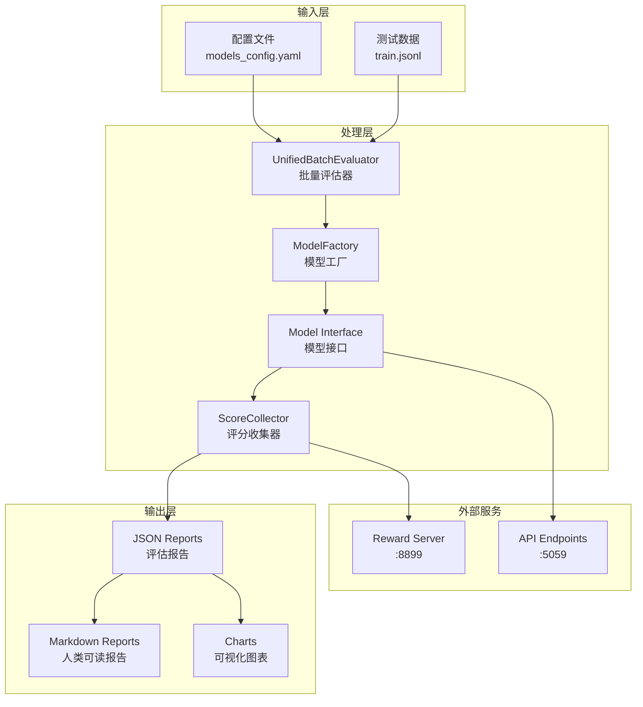

# Model Evaluation System Architecture
## 🏗️ 系统架构详解与数据流分析

---

## 📋 目录

1. [系统概述](#系统概述)
2. [核心架构设计](#核心架构设计)
3. [详细数据流](#详细数据流)
4. [模块层级结构](#模块层级结构)
5. [核心组件详解](#核心组件详解)
6. [配置体系](#配置体系)
7. [执行流程](#执行流程)
8. [接口设计](#接口设计)
9. [并发与性能优化](#并发与性能优化)
10. [错误处理机制](#错误处理机制)

---

## 🎯 系统概述

Model Evaluation System 是一个用于评估本地模型和API模型在各种基准测试上性能的综合框架。系统采用分层架构设计，支持高并发批量评估，并提供丰富的可视化报告。

### 核心特性
- **统一接口**: 为本地模型和API模型提供统一的抽象接口
- **异步处理**: 基于 asyncio 的高性能异步评估
- **资源管理**: 智能GPU内存管理和API并发控制
- **可扩展性**: 易于添加新模型类型和评估指标
- **可视化**: 自动生成评估报告和对比图表

---

## 🏛️ 核心架构设计

### 分层架构

```
┌─────────────────────────────────────────────────────────────┐
│                      User Interface Layer                    │
│  (Shell Scripts / Batch Files / Python Entry Points)        │
├─────────────────────────────────────────────────────────────┤
│                     Configuration Layer                      │
│        (YAML Configs / Environment Variables)               │
├─────────────────────────────────────────────────────────────┤
│                      Evaluator Layer                         │
│    (UnifiedBatchEvaluator / ModelEvaluator)                │
├─────────────────────────────────────────────────────────────┤
│                     Interface Layer                          │
│  (BaseModelInterface / LocalModelInterface / APIModelInterface)│
├─────────────────────────────────────────────────────────────┤
│                      Utility Layer                          │
│ (ModelFactory / ScoreCollector / ReportGenerator / etc.)   │
├─────────────────────────────────────────────────────────────┤
│                    External Services                         │
│        (Reward Server / API Endpoints)                      │
└─────────────────────────────────────────────────────────────┘
```

---

## 🔄 详细数据流

### 主要数据流程



### 数据转换流程

1. **输入阶段**
   ```yaml
   # models_config.yaml
   models:
     - name: "model-name"
       type: "api/local"
       [配置参数...]
   ```
   ↓
2. **加载阶段**
   ```python
   test_samples = load_jsonl("train.jsonl")
   model_configs = load_yaml("models_config.yaml")
   ```
   ↓
3. **实例化阶段**
   ```python
   model = ModelFactory.create_model(config)
   await model.initialize()
   ```
   ↓
4. **生成阶段**
   ```python
   solution = await model.generate(prompt, **params)
   ```
   ↓
5. **评估阶段**
   ```python
   score = await score_collector.compute_score({
       "data_source": "gsm8k",
       "solution_str": solution,
       "ground_truth": ground_truth
   })
   ```
   ↓
6. **报告阶段**
   ```python
   report = await report_generator.generate_model_report(
       scores, model_info, test_samples
   )
   ```

---

## 📁 模块层级结构

### 详细文件架构

```
model_evaluation/
│
├── 📁 configs/                         # 配置文件目录
│   ├── models_config.yaml              # 主配置：模型定义与评估参数
│   ├── evaluation_config.yaml          # 单模型评估配置
│   └── example_config.yaml             # 配置模板示例
│
├── 📁 scripts/                         # 执行脚本目录
│   ├── 🔧 evaluate_all_models.sh       # Linux/Mac 批量评估脚本
│   ├── 🔧 evaluate_all_models.bat      # Windows 批量评估脚本
│   ├── 🐍 run_unified_evaluation.py    # 统一评估入口
│   └── 🐍 run_evaluation.py            # 单模型评估入口
│
├── 📁 core/                           # 核心功能模块
│   │
│   ├── 📁 interfaces/                 # 模型接口层
│   │   ├── model_interface.py         # 抽象基类
│   │   │   └── BaseModelInterface     # 定义统一接口
│   │   ├── local_model_interface.py   # 本地模型实现
│   │   │   └── LocalModelInterface    # HuggingFace/LoRA支持
│   │   └── api_model_interface.py     # API模型实现
│   │       └── APIModelInterface      # OpenAI兼容API
│   │
│   ├── 📁 evaluators/                 # 评估器层
│   │   ├── unified_batch_evaluator.py # 批量评估主控
│   │   │   └── UnifiedBatchEvaluator  # 协调全流程
│   │   ├── model_evaluator.py         # 单模型评估
│   │   │   └── ModelEvaluator         # 核心评估逻辑
│   │   └── batch_evaluator.py         # 遗留批量评估
│   │       └── BatchModelEvaluator    # 向后兼容
│   │
│   └── 📁 utils/                      # 工具模块
│       ├── model_factory.py           # 模型创建工厂
│       │   └── ModelFactory            # 根据配置创建模型
│       ├── score_collector.py         # 评分收集
│       │   └── ScoreCollector         # 与Reward Server交互
│       ├── report_generator.py        # 报告生成
│       │   └── ReportGenerator        # 生成JSON/MD/图表
│       ├── reward_server_checker.py   # 服务健康检查
│       │   └── RewardServerChecker    # 监控Reward Server
│       ├── api_connection_pool.py     # API连接池
│       │   └── APIConnectionPool      # 管理并发请求
│       ├── resource_manager.py        # 资源管理
│       │   └── ModelResourceManager   # GPU内存管理
│       └── config_validator.py        # 配置验证
│           └── ConfigValidator        # 验证配置完整性
│
└── 📁 results/                        # 输出结果目录
    ├── 📊 evaluation_results.json      # 汇总结果
    ├── 📄 model_comparison.md          # 对比报告
    ├── 📈 charts/                      # 可视化图表
    │   ├── overall_scores.png         # 总分对比
    │   ├── benchmark_heatmap.png      # 性能热图
    │   └── model_rankings.png         # 排名图表
    └── 🔍 intermediate_*.json         # 中间结果
```

---

## 🔧 核心组件详解

### 1. UnifiedBatchEvaluator
**位置**: `core/evaluators/unified_batch_evaluator.py`
**职责**: 协调整个评估流程

```python
class UnifiedBatchEvaluator:
    def __init__(self, config):
        self.test_data_path = config['test_data_path']
        self.reward_server_url = config['reward_server_url']
        self.output_dir = config['output_dir']
        self.eval_batch_size = config['eval_batch_size']
        
    async def evaluate_models(self, model_configs):
        # 1. 验证配置
        # 2. 检查服务健康
        # 3. 加载测试数据
        # 4. 逐个评估模型
        # 5. 生成对比报告
```

### 2. ModelFactory
**位置**: `core/utils/model_factory.py`
**职责**: 根据配置创建适当的模型接口

```python
class ModelFactory:
    @staticmethod
    def create_model(config) -> BaseModelInterface:
        model_type = config['type']
        
        if model_type == 'api':
            return APIModelInterface(config)
        elif model_type in ['local', 'huggingface']:
            return LocalModelInterface(config)
        elif model_type == 'local_with_lora':
            return LocalModelInterface(config)  # with LoRA support
```

### 3. ScoreCollector
**位置**: `core/utils/score_collector.py`
**职责**: 与Reward Server交互获取评分

```python
class ScoreCollector:
    def __init__(self, server_url):
        self.compute_endpoint = f"{server_url}/compute_score"
        
    async def batch_evaluate(self, test_samples, solutions, batch_size=8):
        # 并发控制
        semaphore = asyncio.Semaphore(batch_size)
        # 批量发送请求
        tasks = [self.compute_score(data) for data in requests]
        results = await asyncio.gather(*tasks)
```

### 4. APIModelInterface
**位置**: `core/interfaces/api_model_interface.py`
**职责**: 处理API模型的请求

```python
class APIModelInterface(BaseModelInterface):
    def __init__(self, config):
        self.api_endpoints = config['api_endpoints']
        self.api_keys = config['api_keys']
        self.max_concurrency = config.get('max_concurrency', 10)
        
    async def generate(self, prompt, **kwargs):
        # 负载均衡
        endpoint, key = self._get_next_endpoint()
        # 发送请求
        response = await self._make_request(endpoint, key, prompt)
```

---

## ⚙️ 配置体系

### 核心配置结构

```yaml
# models_config.yaml
test_data:
  path: "path/to/test.jsonl"
  max_samples: 100

reward_server:
  url: "http://localhost:8899"

evaluation:
  batch_size: 8
  output_dir: "./results"
  save_intermediate: true

models:
  - name: "API-Model"
    type: "api"
    api_endpoints: ["http://localhost:5059"]
    api_keys: [""]
    model: "model-name"
    max_concurrency: 15
    generation_params:
      max_new_tokens: 4096
      temperature: 0.7
      
  - name: "Local-Model"
    type: "local"
    base_model_path: "/path/to/model"
    device_map: "auto"
    torch_dtype: "bfloat16"
    generation_params:
      max_new_tokens: 4096
```

### 参数传递链

```
Shell Script Arguments
    ↓
Python Argparse
    ↓
Config Override
    ↓
UnifiedBatchEvaluator Config
    ↓
Model Factory Config
    ↓
Model Interface Config
    ↓
Generation Parameters
```

---

## 🚀 执行流程

### 完整执行序列

1. **启动阶段**
   ```bash
   ./evaluate_all_models.sh -n 100 -f api
   ```

2. **环境准备**
   ```python
   # 激活conda环境
   conda activate workflow
   # 设置PYTHONPATH
   export PYTHONPATH="${PYTHONPATH}:$(pwd)"
   ```

3. **服务检查**
   ```python
   # 检查Reward Server
   checker = RewardServerChecker()
   await checker.wait_for_server()
   ```

4. **配置加载**
   ```python
   config = load_yaml("models_config.yaml")
   # 命令行参数覆盖
   if args.max_samples:
       config['test_data']['max_samples'] = args.max_samples
   ```

5. **数据加载**
   ```python
   test_samples = load_jsonl("test.jsonl")
   if max_samples:
       test_samples = test_samples[:max_samples]
   ```

6. **模型评估循环**
   ```python
   for model_config in model_configs:
       # 创建模型
       model = ModelFactory.create_model(model_config)
       await model.initialize()
       
       # 生成解决方案
       solutions = []
       for sample in test_samples:
           solution = await model.generate(sample['prompt'])
           solutions.append(solution)
       
       # 批量评分
       scores = await score_collector.batch_evaluate(
           test_samples, solutions, batch_size=8
       )
       
       # 生成报告
       report = await report_generator.generate_model_report(
           scores, model_info, test_samples
       )
       
       # 清理资源
       await model.cleanup()
   ```

7. **报告生成**
   ```python
   # 生成对比报告
   comparison = report_generator.generate_comparison_report(all_reports)
   # 生成图表
   report_generator.generate_charts(comparison)
   ```

---

## 🔌 接口设计

### BaseModelInterface 统一接口

```python
class BaseModelInterface(ABC):
    """所有模型必须实现的抽象接口"""
    
    @abstractmethod
    async def initialize(self):
        """初始化模型"""
        pass
    
    @abstractmethod
    async def generate(self, 
                      prompt: Union[str, List[Dict]], 
                      **kwargs) -> str:
        """生成响应"""
        pass
    
    @abstractmethod
    async def cleanup(self):
        """清理资源"""
        pass
    
    @abstractmethod
    def get_info(self) -> Dict:
        """获取模型信息"""
        pass
```

### 接口实现差异

| 特性 | LocalModelInterface | APIModelInterface |
|------|-------------------|------------------|
| 初始化 | 加载模型到GPU | 测试API连接 |
| 资源管理 | GPU内存管理 | 连接池管理 |
| 并发处理 | 单实例串行 | 多端点并行 |
| 错误处理 | OOM处理 | 重试机制 |
| 清理 | 释放GPU内存 | 关闭连接 |

---

## ⚡ 并发与性能优化

### 并发控制机制

1. **API模型并发**
   ```python
   # 使用信号量控制并发数
   semaphore = asyncio.Semaphore(max_concurrency)
   
   async def process_with_semaphore(request):
       async with semaphore:
           return await make_request(request)
   ```

2. **批处理优化**
   ```python
   # 动态批处理大小
   batch_size = min(
       config['batch_size'],
       available_memory // estimated_model_size
   )
   ```

3. **负载均衡**
   ```python
   # Round-robin 端点选择
   endpoint_idx = (endpoint_idx + 1) % len(endpoints)
   ```

### 性能监控

```python
# 请求统计
self.total_requests += 1
self.successful_requests += success_count
self.failed_requests += fail_count
self.avg_latency = sum(latencies) / len(latencies)
```

---

## 🛡️ 错误处理机制

### 分层错误处理

1. **配置验证层**
   ```python
   try:
       ConfigValidator.validate_config(config)
   except ValidationError as e:
       logger.error(f"配置无效: {e}")
       sys.exit(1)
   ```

2. **服务连接层**
   ```python
   try:
       await reward_server.check_health()
   except ConnectionError:
       logger.error("Reward Server 未运行")
       # 尝试自动启动或退出
   ```

3. **模型执行层**
   ```python
   try:
       result = await model.generate(prompt)
   except torch.cuda.OutOfMemoryError:
       await model.cleanup()
       # 降级到CPU或减小批处理
   except APIError as e:
       # 重试机制
       for attempt in range(max_retries):
           result = await retry_request()
   ```

4. **评分计算层**
   ```python
   try:
       score = await compute_score(solution)
   except TimeoutError:
       # 返回默认分数
       return {'score': 0.0, 'error': 'timeout'}
   ```

### 容错策略

- **优雅降级**: GPU OOM → CPU模式
- **自动重试**: API失败 → 指数退避重试
- **部分失败处理**: 继续处理其他样本
- **检查点保存**: 定期保存中间结果

---

## 📊 关键数据结构

### 测试数据格式
```json
{
    "data_source": "gsm8k",
    "prompt": "问题描述...",
    "ability": "math_reasoning",
    "reward_model": {
        "ground_truth": [0, 1, 2]
    },
    "extra_info": {
        "sample_id": 0,
        "problem_indices": [0, 1, 2]
    }
}
```

### 评分请求格式
```json
{
    "data_source": "gsm8k",
    "solution_str": "生成的解决方案",
    "ground_truth": [0, 1, 2],
    "extra_info": {...},
    "model_name": "model-name"
}
```

### 评估报告格式
```json
{
    "model": {
        "name": "model-name",
        "type": "api/local",
        "config": {...}
    },
    "timestamp": "2024-01-01T00:00:00",
    "total_samples": 100,
    "overall_score": 0.85,
    "success_rate": 0.90,
    "benchmark_scores": {
        "gsm8k": 0.85,
        "mbpp": 0.80
    },
    "evaluation_results": {
        "mean_score": 0.85,
        "std_score": 0.12,
        "median_score": 0.90
    }
}
```

---

## 🔗 外部依赖

### Reward Server 交互
- **端口**: 8899 (默认)
- **健康检查**: GET /health
- **评分计算**: POST /compute_score
- **超时设置**: 300秒

### API 代理服务
- **端口**: 5059 (示例)
- **协议**: OpenAI兼容API
- **并发限制**: 根据配置动态调整

---

## 📈 扩展点

### 添加新模型类型
1. 创建新的接口类继承 `BaseModelInterface`
2. 在 `ModelFactory` 中注册新类型
3. 更新配置验证逻辑
4. 添加相应的测试用例

### 添加新的评估指标
1. 扩展 `ScoreCollector` 添加新的评分方法
2. 更新 `ReportGenerator` 包含新指标
3. 修改报告模板显示新指标
4. 更新可视化图表

### 自定义报告格式
1. 继承 `ReportGenerator` 类
2. 重写报告生成方法
3. 添加新的模板或格式化逻辑
4. 注册到配置系统

---

## 🎓 最佳实践

1. **配置管理**
   - 使用环境变量存储敏感信息
   - 为不同环境准备不同配置文件
   - 配置文件版本控制

2. **资源优化**
   - 根据GPU内存动态调整批处理大小
   - 使用量化技术减少内存占用
   - 实施连接池避免资源浪费

3. **错误处理**
   - 实施多层错误捕获
   - 记录详细的错误日志
   - 提供有意义的错误消息

4. **性能调优**
   - 使用异步IO提高吞吐量
   - 实施请求批处理
   - 缓存常用结果

5. **监控与日志**
   - 记录关键性能指标
   - 实施健康检查
   - 保存中间结果便于调试

---

## 📝 总结

Model Evaluation System 通过精心设计的分层架构，实现了高效、可扩展的模型评估功能。系统的核心优势在于：

- **统一抽象**: 无论本地模型还是API模型，都通过统一接口处理
- **高性能**: 异步处理和并发控制确保评估效率
- **可扩展**: 模块化设计便于添加新功能
- **健壮性**: 完善的错误处理和容错机制
- **易用性**: 丰富的配置选项和自动化脚本

这个架构为大规模模型评估提供了坚实的基础，同时保持了良好的可维护性和扩展性。