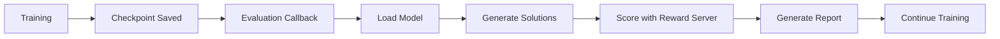

# LLaMA3/Qwen2.5 H100 Training with Auto-Evaluation

## Overview

This directory contains the production-ready training configuration for LLaMA-3.1-8B and Qwen-2.5-7B models on H100/L20Z GPUs with integrated automatic evaluation during training. The system automatically evaluates model checkpoints using the ScoreFlow reward server to track performance improvements throughout the training process.

## Features

### Core Capabilities

- **Multi-Model Support**: Supports both LLaMA-3.1-8B-Instruct and Qwen-2.5-7B-Instruct models
- **Automatic Evaluation**: Evaluates checkpoints during training using the ScoreFlow reward server
- **Loss Masking**: Optional feature to compute loss only on assistant responses for better training quality
- **Distributed Training**: DeepSpeed ZeRO-3 optimization across 8 GPUs
- **Real-time Monitoring**: Tracks model performance on benchmarks during training
- **Asynchronous Evaluation**: Non-blocking evaluation that doesn't interrupt training

### Evaluation System

The integrated evaluation system provides:

1. **Checkpoint Monitoring**: Automatically detects and evaluates new checkpoints
2. **Reward Server Integration**: Interfaces with ScoreFlow reward server for scoring
3. **Benchmark Testing**: Evaluates on GSM8K, MBPP, HumanEval, and other benchmarks
4. **Performance Reports**: Generates detailed JSON and Markdown reports
5. **Trend Analysis**: Tracks performance metrics over training steps

## Quick Start

### Prerequisites

```bash
# Activate the training environment
source /opt/anaconda3/etc/profile.d/conda.sh && conda activate workflow

# Install dependencies
pip install -r requirements.txt
```

### Basic Training with Evaluation

```bash
# Navigate to the directory
cd my_llama3_h100_with_eval/

# Run training with automatic evaluation
bash scripts/train_with_eval.sh

# Or run without evaluation
bash scripts/train.sh
```

### Configuration Options

Edit the training script to customize:

```bash
# Model selection
MODEL_TYPE="llama"  # or "qwen"

# Evaluation settings
ENABLE_AUTO_EVAL=true   # Enable/disable evaluation
EVAL_INTERVAL=1         # Evaluate every N checkpoints
EVAL_BATCH_SIZE=4       # Batch size for evaluation
MAX_EVAL_SAMPLES=50     # Limit samples for testing
```

## Directory Structure

```
my_llama3_h100_with_eval/
├── configs/                    # Configuration files
│   ├── evaluation/            # Evaluation configs
│   │   └── eval_config.yaml
│   └── training/              # Training configs
│       ├── accelerate_config.yaml
│       └── deepspeed_z3.json
├── docs/                      # Documentation
│   ├── evaluation.md         # Evaluation system design
│   └── guides/               # Setup guides
├── scripts/                   # Training scripts
│   ├── train_with_eval.sh   # Training with evaluation
│   ├── train.sh              # Basic training
│   └── utils/                # Utility scripts
├── src/                       # Source code
│   ├── evaluation/           # Evaluation modules
│   │   ├── evaluation_callback.py
│   │   ├── model_evaluator.py
│   │   └── score_collector.py
│   └── training/             # Training modules
│       ├── data_collator.py
│       └── trainer.py
├── tests/                     # Test suites
│   ├── benchmarks/           # Benchmark tests
│   ├── integration/          # Integration tests
│   └── unit/                 # Unit tests
└── outputs/                   # Training outputs
    ├── checkpoints/          # Model checkpoints
    ├── logs/                 # Training logs
    └── reports/              # Evaluation reports
```

## Training Configuration

### Hardware Requirements

- **GPUs**: 8x NVIDIA L20Z (80GB each) or H100
- **Total GPU Memory**: 640GB
- **CPU RAM**: 256GB recommended
- **Storage**: 2TB+ for checkpoints and data

### Training Parameters

#### LLaMA-3.1-8B
```yaml
batch_size: 4 per device
gradient_accumulation: 4 steps
global_batch_size: 128
learning_rate: 1e-5
max_sequence_length: 4096
precision: bfloat16
```

#### Qwen-2.5-7B
```yaml
batch_size: 4 per device
gradient_accumulation: 4 steps
global_batch_size: 128
learning_rate: 2e-5
max_sequence_length: 8192
precision: bfloat16
```

### DeepSpeed Configuration

The system uses DeepSpeed ZeRO-3 for efficient distributed training:

- **Stage 3 Optimization**: Full model sharding across GPUs
- **BF16 Precision**: Native H100 support
- **No CPU Offloading**: Sufficient GPU memory
- **Gradient Checkpointing**: Memory optimization

## Evaluation System

### How It Works

1. **Checkpoint Detection**: Monitors training for new checkpoints
2. **Model Loading**: Loads checkpoint for evaluation
3. **Test Data Processing**: Generates solutions for test problems
4. **Reward Server Scoring**: Sends solutions to ScoreFlow server
5. **Report Generation**: Creates performance reports

### Evaluation Flow



### Report Format

Evaluation reports include:

- Overall accuracy score
- Per-benchmark performance
- Success/failure rates
- Performance trends
- Detailed error analysis

Example report structure:
```json
{
  "checkpoint": "checkpoint-1000",
  "timestamp": "2024-01-15T10:30:00",
  "overall_score": 0.75,
  "benchmark_scores": {
    "gsm8k": 0.82,
    "mbpp": 0.68
  }
}
```

## Loss Masking

Loss masking improves training by computing loss only on assistant responses:

### Enable Loss Masking

```bash
# In training script
USE_LOSS_MASK=true

# Or via environment variable
USE_LOSS_MASK_OVERRIDE=true bash scripts/train_with_eval.sh
```

### Benefits

- Better generalization
- Focuses learning on actual outputs
- Prevents overfitting on prompts
- Improved downstream performance

## Testing

### Run Tests

```bash
# Unit tests
python -m pytest tests/unit/

# Integration tests
python -m pytest tests/integration/

# Benchmark tests
python -m pytest tests/benchmarks/

# Test evaluation system
python tests/integration/test_evaluation_system.py
```

### Test Loss Masking

```bash
python tests/unit/test_loss_mask.py
```

## Monitoring

### Training Metrics

Monitor training progress with:

- **WandB**: Real-time metrics dashboard
- **TensorBoard**: Local visualization
- **Log Files**: Detailed training logs
- **Evaluation Reports**: Performance tracking

### Key Metrics

- Training loss
- Evaluation accuracy
- Benchmark scores
- Token statistics
- GPU utilization

## Troubleshooting

### Common Issues

1. **GPU OOM Error**
   - Reduce batch size
   - Enable gradient checkpointing
   - Reduce evaluation batch size

2. **Reward Server Connection Failed**
   - Check server is running: `curl http://localhost:8899/health`
   - Verify network connectivity
   - Check firewall settings

3. **Slow Evaluation**
   - Reduce MAX_EVAL_SAMPLES for testing
   - Enable ASYNC_EVAL
   - Increase EVAL_INTERVAL

4. **DeepSpeed Errors**
   - Verify CUDA and PyTorch versions
   - Check DeepSpeed configuration
   - Ensure all GPUs are available

### Debug Mode

Enable debug logging:

```bash
export TORCH_DISTRIBUTED_DEBUG=DETAIL
export CUDA_LAUNCH_BLOCKING=1
bash scripts/train_with_eval.sh
```

## Advanced Usage

### Custom Evaluation Data

```bash
# Specify custom test data
EVAL_TEST_DATA="path/to/custom_test.jsonl"
bash scripts/train_with_eval.sh
```

### Distributed Training

```bash
# Multi-node training
deepspeed --num_nodes=2 \
          --hostfile=hostfile \
          src/train.py --config configs/training/config.yaml
```

### Resume Training

```bash
# Resume from checkpoint
python src/train.py \
  --resume_from_checkpoint outputs/checkpoints/checkpoint-5000 \
  --enable_auto_eval true
```

## Performance Optimization

### Training Speed

- Use Flash Attention 2 for faster attention
- Enable BF16 precision on H100
- Optimize batch size for GPU memory
- Use gradient accumulation wisely

### Evaluation Speed

- Batch evaluation requests
- Use asynchronous evaluation
- Cache model between evaluations
- Limit evaluation samples during development

## Best Practices

1. **Start Small**: Test with limited samples first
2. **Monitor Memory**: Watch GPU memory usage
3. **Regular Checkpoints**: Save frequently
4. **Version Control**: Track configuration changes
5. **Backup Data**: Keep training data backups

## Contributing

When contributing:

1. Write tests for new features
2. Update documentation
3. Follow code style guidelines
4. Test on small datasets first
5. Create detailed pull requests

## License

This project is part of the Flow_RL system. See main repository for license details.

## Support

For issues or questions:

1. Check documentation in `docs/`
2. Review test examples in `tests/`
3. Consult CLAUDE.md for AI assistance guidelines
4. Open an issue with detailed information

## Related Documentation

- [Evaluation System Design](docs/evaluation.md)
- [H100 Setup Guide](docs/guides/h100_setup.md)
- [Loss Masking Guide](docs/guides/loss_masking.md)
- [Main Project README](../README.md)